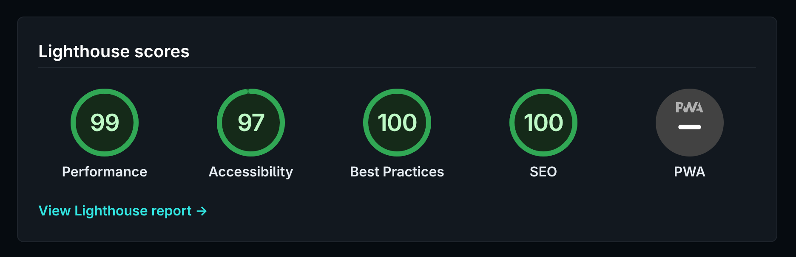

# mnml for Hugo


A clean and simple minimalist theme for Hugo, ported from the [mnml Micro.blog theme](https://github.com/jimmitchell/mnml) by [Jim Mitchell](https://jimmitchell.org).

**[View Demo](https://mnml.micro.blog)** • Built for speed with excellent Lighthouse scores:



## Quick Start

```bash
# Add theme to your Hugo site
cd your-hugo-site
git submodule add https://github.com/shawnyeager/mnml-hugo.git themes/mnml-hugo

# Copy example configuration
cp themes/mnml-hugo/exampleSite/hugo.toml hugo.toml

# Create your first post
hugo new content/post/my-first-post.md

# Start the server
hugo server
```

<details>
<summary><b>Other Installation Methods</b></summary>

### Clone Method
```bash
cd your-hugo-site/themes
git clone https://github.com/shawnyeager/mnml-hugo.git
```

### Hugo Modules (requires Go)
In your `hugo.toml`:
```toml
[module]
  [[module.imports]]
    path = "github.com/shawnyeager/mnml-hugo"
```
</details>

## Requirements

**Hugo Extended v0.151.0+** — Required for image processing features (WebP optimization, responsive images). Standard Hugo works but without image optimization.

## Features

### Core Features
- 🌍 **12 languages** supported with full i18n
- 🌓 **Light/dark mode** with automatic system detection
- 📱 **Mobile responsive** design
- 🔍 **Built-in search** functionality
- 📄 **Pagination** on all post-related pages

### Content & Media
- 🖼️ **Advanced image processing** (WebP, responsive srcset: 400w/800w/1200w)
- 📸 **Photo layouts** (grid or masonry)
- 🎥 **Automatic video embedding** (MP4, MOV, WebM)
- 📝 **Microblog-style** titleless posts

### Customization
- 🎨 **Category filtering** for home page and photos
- 📌 **Pinned posts** by category
- 🖥️ **Header width** options (wide or narrow)
- 📅 **Date format** options (short or long)
- 👤 **Custom avatars** or hide avatar entirely
- 🗃️ **Archive years filtering** for posts by year
- 🐘 **Fediverse Creator** tag support

<details>
<summary><b>View all features</b></summary>

- Featured post category setting
- Custom home page category setting
- Multiple, comma-separated home page categories
- Display full posts on category pages
- Custom photos page category setting
- Wide or narrow photo page layout setting
- Show all image formats on photos page
- Show only first image from multi-image posts
- Reading time display
- Category counts on archive pages
- Customizable search results count
- RSS feed customization
- Footer customization options

</details>

## Configuration

Copy `exampleSite/hugo.toml` to your site for a complete working configuration. All parameters are optional with sensible defaults.

<details>
<summary><b>Essential Configuration</b></summary>

```toml
baseURL = "https://example.com/"
languageCode = "en"
title = "My Blog"
theme = "mnml-hugo"
defaultContentLanguage = "en"

[pagination]
  pagerSize = 20

[permalinks]
  post = "/:filename/"

[taxonomies]
  category = "categories"
  tag = "tags"

[outputs]
  home = ["HTML", "RSS", "archivejson"]
  section = ["HTML", "RSS"]
  archive = ["HTML", "archivehtml"]  # Required for archive_years feature

[outputFormats.RSS]
  mediaType = "application/rss+xml"
  baseName = "feed"

[outputFormats.archivejson]
  mediaType = "application/json"
  baseName = "archive/index"
  isPlainText = true
  notAlternative = true

[outputFormats.archivehtml]
  mediaType = "text/html"
  baseName = "index"

[params]
  description = "A minimal, simple and clean blog."
  itunes_description = "A minimal, simple and clean blog."
  theme_seconds = "1"  # Cache busting version

# Image processing settings (Hugo Extended only)
[imaging]
  quality = 85
  resampleFilter = "Lanczos"
  anchor = "Smart"

[imaging.exif]
  disableDate = false
  disableLatLong = true
```

</details>

<details>
<summary><b>Theme Parameters Reference</b></summary>

### Date & Time
| Parameter | Type | Default | Description |
|-----------|------|---------|-------------|
| `use_short_date` | boolean | false | Use short date format |
| `show_read_time` | boolean | true | Show reading time on posts |

### Header & Avatar
| Parameter | Type | Default | Description |
|-----------|------|---------|-------------|
| `narrow_header` | boolean | false | Use narrow header width |
| `hide_avatar` | boolean | false | Hide site avatar |
| `custom_avatar` | string | - | URL to custom avatar image |

### Home Page
| Parameter | Type | Default | Description |
|-----------|------|---------|-------------|
| `home_category` | string | - | Filter by category (comma-separated for multiple) |
| `pinned_category` | string | "Pinned" | Category for pinned post |
| `show_full_post` | boolean | false | Show full posts vs summaries |

### Category/Archive Pages
| Parameter | Type | Default | Description |
|-----------|------|---------|-------------|
| `category_full_post` | boolean | false | Show full posts on category pages |
| `show_categories` | boolean | true | Show category list on archives |
| `show_category_count` | boolean | true | Show post counts on category tags |
| `archive_years` | boolean | false | Enable year filtering on archive page* |

*Archive Years Feature: Adds a dropdown to filter archive posts by year. Based on the [Archive Years plugin](https://github.com/jimmitchell/plugin-mnml-archive-years) by Jim Mitchell. Requires `archivehtml` output format.

### Photos
| Parameter | Type | Default | Description |
|-----------|------|---------|-------------|
| `photos_category` | string | "Photos" | Filter photos by category |
| `all_formats` | boolean | false | Show all image formats |
| `masonry_layout` | boolean | false | Use masonry layout (false = grid) |
| `full_width_photos` | boolean | false | Use wider photos layout |
| `single_image` | boolean | false | Show only first image |

### Search
| Parameter | Type | Default | Description |
|-----------|------|---------|-------------|
| `search_results` | integer | 5 | Number of search results to display |

### Footer
| Parameter | Type | Default | Description |
|-----------|------|---------|-------------|
| `hide_copyright` | boolean | false | Hide copyright notice |
| `footer_rss` | boolean | true | Add RSS link to footer |
| `hide_credit` | boolean | false | Hide theme credits |

### Advanced
| Parameter | Type | Default | Description |
|-----------|------|---------|-------------|
| `fediverse_creator` | string | - | Fediverse creator tag (e.g., @user@mastodon.social) |
| `archive-paginate` | integer | 30 | Archive page size |

</details>

## Creating Content

### Regular Posts

```markdown
---
title: "My First Post"
date: 2025-10-06T10:00:00-00:00
categories: ["Blog"]
---

Your content here...
```

Posts go in `content/post/` directory.

### Microblog Posts

Omit the title for microblog-style posts:

```markdown
---
date: 2025-10-06T10:00:00-00:00
---

Just a quick thought...
```

<details>
<summary><b>Photo Posts</b></summary>

Add photos using the `photos` parameter. Store images in `assets/images/` for automatic processing:

```markdown
---
title: "My Photo Collection"
date: 2025-10-06T10:00:00-00:00
categories: ["Photos"]
photos:
  - "images/photo1.jpg"
  - "images/photo2.jpg"
---

Optional description...
```

Or use inline markdown:
```markdown

```

**Image Processing** (Hugo Extended):
- Auto-converted to WebP format
- 3 responsive sizes generated (400w, 800w, 1200w)
- Lazy loading and proper dimensions
- Cached in `resources/` for fast rebuilds

Store images in `assets/images/` (processed) or `static/images/` (served as-is).

</details>

<details>
<summary><b>Video Posts</b></summary>

Videos (.mp4, .mov, .webm) are automatically embedded. Store in `static/images/`:

**Simple video:**
```markdown
[Video description](images/video.mp4)
```

**With poster image:**
```markdown
[Video description](images/video.mp4 "images/poster.png")
```

Automatically converts to HTML5 video players with controls.

</details>

<details>
<summary><b>Search Page</b></summary>

Create `content/search.md`:

```markdown
---
title: "Search"
---


```

Add to menu in `hugo.toml`:

```toml
[[menu.main]]
  name = "Search"
  url = "/search/"
  weight = 4
```

</details>

## Customization

### Custom CSS

Override theme styles by creating `static/css/custom.css` in your site:

```css
/* Light mode */
:root {
  --text-color: #333333;
  --link-color: #0d88d8;
  --background: #FFFFFF;
}

/* Dark mode */
@media (prefers-color-scheme: dark) {
  :root {
    --text-color: #FFFFFF;
    --link-color: #45c8f7;
    --background: #20232a;
  }
}
```

See the [Micro.blog customization guide](https://mnml.micro.blog/2025/01/23/modifying-the-color-scheme/) for more examples.

### Languages

Supports 12 languages: English, German, Spanish, Finnish, French, Italian, Polish, Portuguese, Russian, Swedish, Ukrainian, Chinese (Traditional).

Set in `hugo.toml`:
```toml
defaultContentLanguage = "de"
```

## Development

```bash
cd exampleSite
hugo server --themesDir ../..
```

Visit http://localhost:1313

<details>
<summary><b>Differences from Micro.blog Version</b></summary>

This Hugo port differs from the [Micro.blog plugin](https://github.com/jimmitchell/mnml):

1. **Configuration**: Uses `hugo.toml` instead of Micro.blog's web UI
2. **Content structure**: Posts go in `content/post/` directory
3. **Platform features**: Some Micro.blog-specific features may not be available
4. **Stub partials**: Includes empty stub files for `microblog_head.html` and `custom_footer.html`

</details>

---

## Credits & Support

**Original Theme**: [Jim Mitchell](https://jimmitchell.org) • [github.com/jimmitchell/mnml](https://github.com/jimmitchell/mnml)
**Hugo Port**: Shawn Yeager • [github.com/shawnyeager/mnml-hugo](https://github.com/shawnyeager/mnml-hugo)

### Localization Contributors

- Swedish: [@robertbirming](https://github.com/robertbirming)
- Ukrainian & Russian: [@luxury-format](https://github.com/luxury-format)
- Chinese (Traditional): [@bobbytung](https://github.com/bobbytung)
- Polish: [@bstn](https://micro.blog/bstn)

### Support

If you enjoy **mnml**, consider [supporting Jim Mitchell](https://buymeacoffee.com/jim.mitchell) ☕

**License**: MIT
